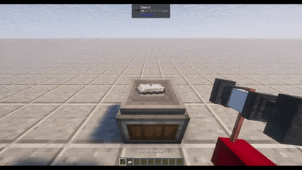
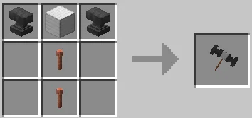

# Create: Easier Sheets 🔨

[**Descargar en Modrinth**](https://modrinth.com/mod/create-easier-sheets)

### Sáltate la configuración cinética del juego temprano para obtener placas y tenlas de inmediato.

## ✨ Cómo funciona
¡Simplemente coloca cualquier lingote válido en un Depot, presiona Agacharse (Shift) + Clic Derecho con el Sturdy Hammer, y aplástalo instantáneamente en una placa!

## 🌟 Características Clave
- **Compatibilidad Dinámica al 100%:** El mod lee automáticamente el administrador de recetas interno de Minecraft. Si un lingote puede ser prensado por una Mechanical Press (Hierro, Oro, Cobre, Latón o incluso lingotes de otros mods), ¡el Sturdy Hammer puede aplastarlo!
- **Crafteo Balanceado:** Requiere materiales pesados para su fabricación (Yunques, Bloque de Hierro, Pararrayos, Cobre), manteniéndolo balanceado para la progresión del juego temprano a medio.

## 🛠️ Receta de Crafteo

### Integración con JEI y EMI.
La integración con JEI es nativa, para EMI por favor considera usar: [https://modrinth.com/mod/tmrv](https://modrinth.com/mod/tmrv) agrega todas las integraciones de jei a EMI.

## 📦 Requisitos
- Minecraft: 1.21.1
- Modloader: NeoForge
- Dependencias: [Create Mod](https://modrinth.com/mod/create)

---

Hecho en México

Echa un vistazo a mi otro mod
[https://modrinth.com/mod/no-creative-menu](https://modrinth.com/mod/no-creative-menu)
